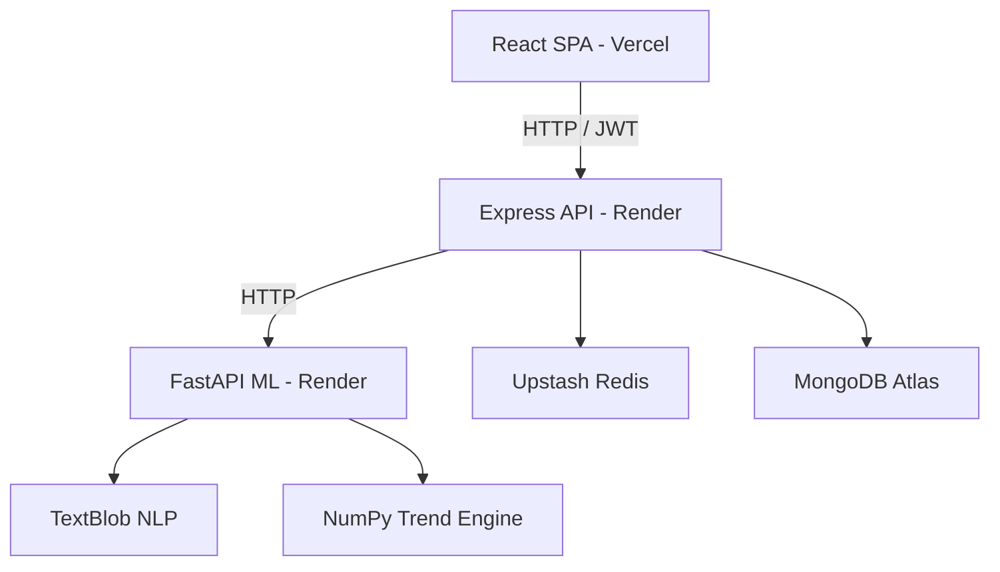

# MindTrack: Mental Health & Mood Tracking Application

[](https://vitejs.dev/)
[](https://react.dev/)
[](https://expressjs.com/)
[](https://fastapi.tiangolo.com/)
[](https://www.mongodb.com/)
[](https://upstash.com/)
[](https://www.typescriptlang.org/)

MindTrack is a production-ready, full-stack mental wellness application. It enables users to track emotional wellbeing, journal their thoughts, view analytical insights, engage with an AI wellness assistant, and participate in gamified positive habits.

The project is structured as a decoupled monorepo containing a React frontend, an Express/TypeScript backend API, and a Python FastAPI machine learning microservice.

---

## ⚡ Quick Links to Detailed Technical Docs
To keep this README readable , deep-dive specifications have been moved to the `/docs` directory:
- [System Architecture](file:///d:/mental-health-app/docs/architecture.md) : Structural diagrams, tier configurations, and data flows.
- [API Reference](file:///d:/mental-health-app/docs/api-reference.md) : Endpoint documentation, payload parameters, and response logs.
- [Database Design](file:///d:/mental-health-app/docs/database-design.md) : Schemas, relationships, compound indices, and ER diagrams.
- [Recommendation Engine](file:///d:/mental-health-app/docs/recommendation-engine.md) : Scoring formulas, context analysis, and weights.
- [Security & CORS](file:///d:/mental-health-app/docs/security.md) : JWT auth, password hashing, Google SSO, and whitelisting.
- [Performance & Caching](file:///d:/mental-health-app/docs/performance.md) : Redis configurations, Mongoose optimizations, and lean queries.
- [Engineering Decisions](file:///d:/mental-health-app/docs/engineering-decisions.md) : Architecture decisions, trade-offs, and ASGI proxy wrappers.
- [Production Deployment](file:///d:/mental-health-app/docs/deployment.md) : Render Blueprints, Vercel SPA routing, and environment setup.

---

## 🚀 Key Engineering Highlights

*   **REST-based Caching:** Integrated **Upstash Redis** to cache slow MongoDB aggregations (insights calculations and XP heatmaps) for 24 hours, reducing dashboard query loads.
*   **Asynchronous Analytics Offloading:** Built a python microservice running **NumPy** for linear regression trend tracking and **TextBlob** for sentiment classification, protecting the Node.js API event loop from CPU-heavy blocks.
*   **Context-Aware Scoring Engine:** Engineered a scoring system that weights dominant mood, energy levels, trends, time-of-day variables, and user feedback history to generate personalized activities.
*   **Security Best Practices:** Secured API endpoints with JWT tokens (7-day TTL), hashed password databases using `bcrypt`, whitelisted Vercel subdomains dynamically, and configured generic endpoints to prevent email enumeration scanning.

---

## 🛠️ Tech Stack

| Layer | Technologies |
| :--- | :--- |
| **Frontend** | React 19, TypeScript, Vite, Tailwind CSS, Zustand, Framer Motion |
| **Backend** | Node.js, Express 5, TypeScript, JWT |
| **Database** | MongoDB (Mongoose), Redis (Upstash) |
| **ML Microservice** | Python, FastAPI, NumPy, TextBlob |
| **External APIs** | Groq API (Llama 3.1), Gmail SMTP Server |
| **Deployment** | Vercel (Frontend), Render (Backend & ML microservice) |

---

## 📐 System Architecture

MindTrack uses a decoupled three-tier architecture separating presentation, core business, and machine learning components.



---

## 🖼️ Screenshots
*(Mockups can be saved inside the `docs/screenshots/` directory)*
1. **Dashboard (`docs/screenshots/dashboard.png`):** Mood trends, active streaks, current level, and daily recommendations.
2. **Mood Logger (`docs/screenshots/mood_log.png`):** Sliders for energy/stress levels and journaling text inputs.
3. **Analytics Page (`docs/screenshots/analytics.png`):** Mood distributions, 14-day mood trend lines, and ML-generated insight cards.
4. **Gamification Store (`docs/screenshots/store.png`):** Virtual customization items (themes, fonts) and consumable Time Travel tickets.

---

## ⚙️ Challenges Solved

1.  **Free-tier Connection Dropouts:** standard Redis TCP clients crashed frequently on Render due to idle socket closures. Resolved by migrating caching to `@upstash/redis` using stateless HTTP REST endpoints.
2.  **Hyphenated Python Directory Imports:** Python module paths with hyphens (`ml-service`) are rejected by import rules. Solved by placing an ASGI entry point wrapper (`ml_service_asgi.py`) at the root to dynamically bind Uvicorn.
3.  **Graceful API Degradation:** If the Python ML service is offline, backend controllers capture the error, log warnings, and fall back to standard rules, keeping mood creation operational.

---

## 💻 Quick Setup

### 1. Prerequisites
- **Node.js** ($\ge 20$) & **Python** ($\ge 3.9$)
- **MongoDB** Instance & **Upstash Redis** REST account
- **Groq API Key** (for chatbot responses)

### 2. Startup Commands

#### Backend:
```bash
cd backend
npm install
cp .env.example .env # configure environment variables
npm run seed:store
npm run dev
```

#### ML Microservice:
```bash
cd ml-service
python -m venv venv
source venv/bin/activate # Windows: venv\Scripts\activate
pip install -r requirements.txt
python -m textblob.download_corpora
uvicorn main:app --reload --port 8000
```

#### Frontend:
```bash
cd frontend
npm install
npm run dev
```

---

## 🔮 Future Improvements
- **Database-Backed Chat Logs:** Migrate AI chat logs from server-side memory to a structured MongoDB collection.
- **ML model integration:** Train an ML model and use it to generate recommendations, currenlty we are generating data for it.
- **Vector Embeddings:** Integrate vector-based similarity scoring (MongoDB Atlas Vector Search) for advanced recommendation maps.

---
 