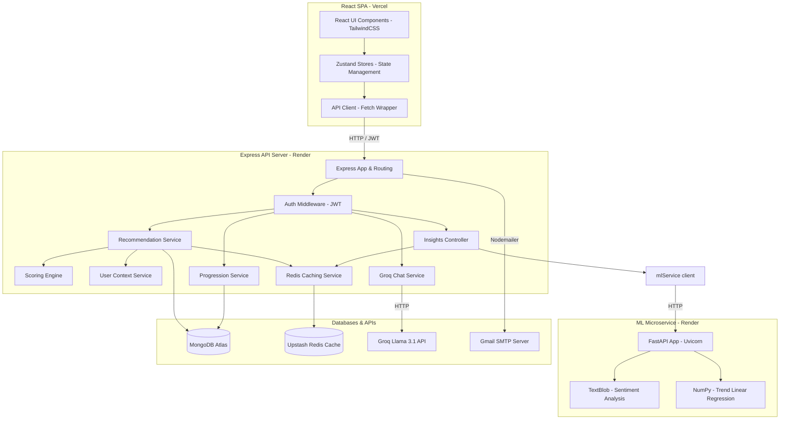

# System Architecture Documentation

This document describes the structural layout, component boundaries, and data flow of the MindTrack application.

## Three-Tier Architecture

MindTrack is built as a decoupled, three-tier application hosted across separate services.

```
┌────────────────────────────────────────────────────────┐
│                   Presentation Tier                    │
│                      (Vercel SPA)                      │
└───────────────────────────┬────────────────────────────┘
                            │ HTTPS / JWT
┌───────────────────────────▼────────────────────────────┐
│                    Application Tier                    │
│                      (Render Web)                      │
└───────────────────────────┬────────────────────────────┘
                            │ HTTP
┌───────────────────────────▼────────────────────────────┐
│                  Machine Learning Tier                 │
│                 (Render ASGI Microservice)             │
└────────────────────────────────────────────────────────┘
```

### 1. Presentation Tier (React SPA)
- **Framework:** React 19 and Vite.
- **Styling:** Tailwind CSS v3 with CSS custom properties (variables) mapped to custom theme stores.
- **State Management:** Zustand stores with automatic LocalStorage syncing (`moodStore`, `userStore`, `themeStore`, `uiStore`).
- **Communication:** Client-side Axios wrapper (`apiClient.ts`) carrying Bearer tokens for authenticated endpoints.

### 2. Application Tier (Express API Server)
- **Framework:** Express 5 written in TypeScript.
- **Authentication:** Custom JWT-verification middleware (`authMiddleware.ts`) decoding bearer signatures.
- **Services Layer:** Decoupled business logic handling progression math, gamified stores, database seeding, and recommendation scoring.
- **Caching Layer:** REST-based Upstash Redis client.

### 3. Machine Learning Tier (FastAPI Microservice)
- **Framework:** FastAPI running under Uvicorn.
- **NLP Sentiment Engine:** TextBlob library classifying sentiment polarity of journal logs into Positive, Negative, and Neutral buckets.
- **Trend Engine:** NumPy linear regression modeling mood volatility and slope variables.

---

## Data Flow & System Diagram

The diagram below details the data flow between client apps, middleware filters, database engines, and external APIs:


