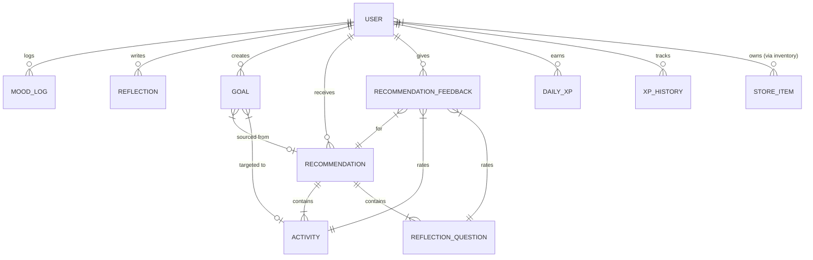

# Database Design Documentation

MindTrack uses MongoDB as its primary database. Mongoose models are used to enforce structured schemas, type safety, and relationship mappings.

---

## Entity Relationship Diagram (ERD)

The following Mermaid ERD visualizes collections and relationship cardinalities within the database:

---

## Entity Models & Schemas

### 1. User (`models/User.ts`)
- **Role:** Handles core accounts, profile fields, levels, gamification balances, and store purchase inventories.
- **Key Fields:**
  - `email` (String, unique, index)
  - `passwordHash` (String, required)
  - `googleId` (String, unique, sparse)
  - `xp` (Number, default 0)
  - `streak` (Number, default 0)
  - `coins` (Number, default 0)
  - `level` (Number, default 0)
  - `inventory` (Array of sub-documents: `{ itemId: ObjectId ref StoreItem, quantity: Number, acquiredAt: Date }`)
  - `preferences` (Sub-document: `{ theme: String, fontColor: String, fontStyle: String }`)
  - `resetPasswordToken` & `resetPasswordExpires` (Used for recovery flow)

### 2. MoodLog (`models/MoodLog.ts`)
- **Role:** Tracks daily mood metrics, energy, stress, and journaling notes.
- **Key Fields:**
  - `userId` (ObjectId ref User, index)
  - `mood` (String, required: e.g., `'Very low'`, `'Low'`, `'Neutral'`, `'Good'`, `'Great'`)
  - `note` (String, optional)
  - `energy` (Number, min 1, max 100)
  - `stress` (Number, min 1, max 100)

### 3. Reflection (`models/Reflection.ts`)
- **Role:** Logs long-form reflection entries alongside NLP sentiment scores.
- **Key Fields:**
  - `userId` (ObjectId ref User, index)
  - `text` (String, required)
  - `date` (Date, index)
  - `sentiment` (Sub-document: `{ score: Number, label: String }`)

### 4. Activity (`models/Activity.ts`)
- **Role:** Holds the collection of recommended activities.
- **Key Fields:**
  - `key` (String, unique index: e.g., `'10-min-walk'`)
  - `title` & `description` (String)
  - `category` (String, index: `'physical' | 'cognitive' | 'creative' | 'social' | 'mindfulness'`)
  - `durationMinutes` (Number)
  - `targetMoods` (Array of Strings, indexed)
  - `targetEnergyLevels` (Array of `'low' | 'medium' | 'high'`)
  - `contraindicated` (Array of Strings)
  - `tags` (Array of Strings)

### 5. Recommendation (`models/Recommendation.ts`)
- **Role:** Caches recommended items for active users.
- **Key Fields:**
  - `userId` (ObjectId ref User, index)
  - `activities` (Array of `{ activityId: ObjectId ref Activity, score: Number, rank: Number }`)
  - `questions` (Array of `{ questionId: ObjectId ref ReflectionQuestion, score: Number, rank: Number }`)
  - `contextSnapshot` (Sub-document containing context logs at generation time)
  - `generatedAt` & `expiresAt` (Date, expires after 4 hours)

### 6. DailyXP (`models/DailyXP.ts`)
- **Role:** Accumulates total XP gained per calendar day. Used for the dashboard calendar heatmap.
- **Key Fields:**
  - `userId` (ObjectId ref User)
  - `date` (Date, representing UTC midnight start of day)
  - `xpGained` (Number)
- **Indices:**
  - Compound unique index: `{ userId: 1, date: 1 }` (guarantees one record per user per day).

---

## Design Rationale & Optimizations

1. **Embedded Inventory Schema:** By embedding purchased item links directly in the `User` schema as an array of sub-documents (rather than creating an `Inventory` collection with joins), we achieve single-query reads during profile loads, boosting API response rates.
2. **Sparse Indexes on Optional OAuth IDs:** Google IDs (`googleId`) and usernames (`username`) use `{ unique: true, sparse: true }`. This enables uniqueness constraints while allowing standard email users to have `null` fields without indexing conflicts.
3. **Compound Heatmap Indexes:** Heatmap retrievals query a range of dates. Indexing by `{ userId: 1, date: 1 }` ensures that queries filtering by date limits execute with index-only scans, avoiding full collection scans.
4. **Cascade Safe Deletes:** Logs are structured so that if daily limits fail, progression records are kept in a separate auditing table (`XPHistory`) preventing data loss.
